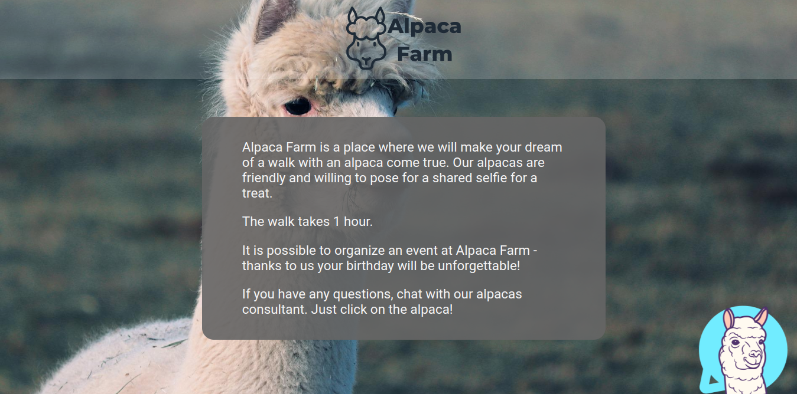
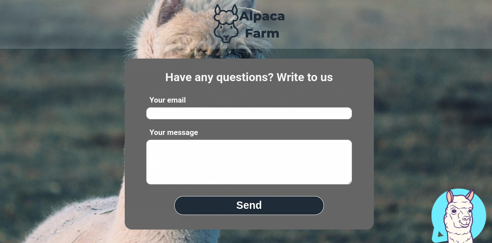

# 🦙 Alpaca Farm - chat app 💬

### Description

The chat app created with using React Router, JavaScript, CSS modules, Socket.IO, Firebase, Express, Nodemon.  

Chat project - which acts as a consultant. It includes an admin panel and the ability to exchange messages in real time.

### Preview

###### Home page

###### View of consultant on user's side

